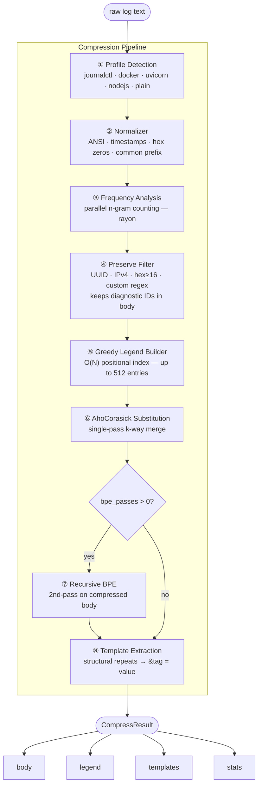

# logzip (Rust)

[](https://pypi.org/project/logzip/)
[](https://pypi.org/project/logzip/)
[](https://pypi.org/project/logzip/)
[](https://opensource.org/licenses/MIT)
[](https://www.rust-lang.org/)

Compress logs **before** sending to LLM. Powered by Rust & PyO3.

```text
raw log → [logzip compress] → compressed text → LLM (Claude Code / Cursor / API)
```

### Before / After

**Raw Log (Uvicorn):**
```text
INFO: 127.0.0.1:45678 - "GET /api/v1/status HTTP/1.1" 200 OK
INFO: 127.0.0.1:45679 - "GET /api/v1/status HTTP/1.1" 200 OK
... (100 similar lines) ...
```

**logzip output:**
```text
--- PREFIX ---
INFO: 127.0.0.1:
--- LEGEND ---
#0# = - "GET /api/v1/status HTTP/1.1" 200 OK
--- BODY ---
45678 #0#
45679 #0#
...
```

Typical savings: **52–58%** on structured logs (systemd, uvicorn, docker).  
Anomalies and unique lines stay uncompressed — visible at a glance in the BODY.

### Why use logzip? (RAG & LLM)

When working with logs in LLMs (Claude, GPT, RAG systems), you face two problems:
1. **Context Limit**: Logs are huge. A 10MB log is ~2.5M tokens.
2. **Noise**: 90% of the log consists of repeating `INFO` and identical requests that drown out the real error.

`logzip` is well-suited for **RAG pipelines**: it compresses the context before sending it to the model, saving money on tokens and increasing answer accuracy by highlighting anomalies.

---

## Performance (7.96 MB Log, ~2M tokens)

Benchmarked on a real 7.96 MB production log.

### logzip modes

| Mode | CLI | Time (ms) | Size (KB) | Saved (%) | Output type |
| :--- | :--- | :--- | :--- | :--- | :--- |
| **fast** | `--quality fast` | ~200 | ~4,900 | ~40% | text/LLM |
| **balanced** | `--quality balanced` | 404 | 3,928 | 52% | text/LLM |
| **balanced + 2 passes** ★ | `--quality balanced --bpe-passes 2` | 418 | 3,404 | **58%** | text/LLM |
| **max** | `--quality max` | 507 | 3,511 | 57% | text/LLM |

★ **Recommended.** A second compression pass finds repeated token sequences in already-compressed text — 14 ms overhead, 7% more savings vs `balanced`.

`--quality max` uses a larger legend (512 vs 128 entries) which adds overhead without a second pass benefit. Use `--bpe-passes 2` with `balanced` instead.

### vs. binary compressors (for context)

| Tool | Time (ms) | Size (KB) | Saved (%) | LLM-readable? |
| :--- | :--- | :--- | :--- | :--- |
| lz4 | 6 | 1,280 | 84% | No |
| zstd (lvl 3) | 14 | 819 | 90% | No |
| zlib (lvl 6) | 69 | 840 | 90% | No |
| **logzip (recommended)** | 418 | 3,404 | 58% | **Yes** |

Binary compressors produce opaque binary blobs — LLMs cannot read them. logzip trades ~30% size for fully human- and LLM-readable output.

Token estimation: 1 token ≈ 4 characters (rough estimate for English-like logs).

### Economic Impact

```text
┌──────────────────────────────────────────────────────────┐
│  logzip Savings (7.96 MB Production Log)                 │
├──────────────────────────────────────────────────────────┤
│  Raw Size:        8,151 KB  (~1,990,000 tokens)          │
│  After balanced:  3,928 KB  (~959,000 tokens,  -52%)     │
│  After 2 passes:  3,404 KB  (~831,000 tokens,  -58%)     │
├──────────────────────────────────────────────────────────┤
│  Cost Before:     $5.97                                  │
│  Cost After:      $2.49      (Claude 3.5 Sonnet Input)   │
│  LLM Efficiency:  2.4x larger context for the same price │
└──────────────────────────────────────────────────────────┘
```

---

## Install

**Python API + `logzip-py` CLI:**
```bash
pip install logzip
```

**Rust CLI + MCP Server:**
```bash
cargo install logzip
```

## CLI

Two CLIs are available. Both provide `compress` and `decompress` subcommands with identical flags.

**Rust binary** (`cargo install logzip` → `logzip`):
```bash
# stdin → stdout
logzip compress < app.log

# quality preset (fast|balanced|max)
logzip compress --quality balanced < app.log

# recommended: balanced + second pass
logzip compress --quality balanced --bpe-passes 2 < app.log

# with preamble (LLM decode instructions at the top)
logzip compress --preamble < app.log > compressed.txt

# save + show stats
logzip compress --stats -i app.log -o app.logzip

# decompress
logzip decompress -i app.logzip
```

**Python CLI** (`pip install logzip` → `logzip-py`):
```bash
# same flags as above, plus:

# explicit profile (otherwise auto-detected)
logzip-py compress --profile journalctl < /tmp/syslog.txt
```

## Python API

```python
from logzip import compress, decompress

# compress
result = compress(raw_log_text)
print(result.render(with_preamble=True))   # → for LLM
print(result.stats_str())                  # → for logs

# fine-grained control
result = compress(
    raw_log_text,
    max_legend_entries=128,   # legend size
    bpe_passes=2,             # second-pass compression (compresses repeated token sequences)
    do_normalize=True,        # collapse timestamps, ANSI, IPs
    do_templates=True,        # structural template extraction
)

# decompress
original = decompress(result.render())
```

## MCP Server (Claude Desktop / Claude Code)

Requires the Rust binary (`cargo install logzip`, see [Install](#install)).

Add to your `claude_desktop_config.json`:

- macOS: `~/Library/Application Support/Claude/claude_desktop_config.json`
- Windows: `%APPDATA%\Claude\claude_desktop_config.json`

```json
{
  "mcpServers": {
    "logzip": {
      "command": "logzip",
      "args": ["mcp", "--allow-dir", "/var/log", "--allow-dir", "/home/user/logs"]
    }
  }
}
```

Or add via Claude Code CLI:

```bash
claude mcp add logzip -- logzip mcp --allow-dir /var/log
```

### Available tools

| Tool | Description |
|---|---|
| `get_stats(path)` | File size, token estimate, detected profile — call first to decide strategy |
| `compress_file(path, quality)` | Compress entire file — for files < 200 K tokens |
| `compress_tail(path, lines, quality)` | Compress last N lines — efficient for large files |

### Available prompts

| Prompt | Description |
|---|---|
| `analyze_logs` | Compresses the log server-side and prepares an SRE analysis context |

### How to use

LLMs don't automatically pick up MCP tools — you need to reference them explicitly. Two ways:

**Option A — explicit ask (works everywhere):**
> "Use logzip to analyze `/var/log/syslog`"

**Option B — `analyze_logs` prompt (Claude Code):**
```
/mcp → logzip → analyze_logs → path: /var/log/syslog
```
This compresses the log server-side and drops an SRE-ready context into the conversation.

**Option C — install the `log-analysis` skill (Claude Code, recommended):**

The skill makes Claude automatically reach for logzip whenever you mention a log file — no explicit instruction needed.

```bash
# 1. Add the logzip repo as a plugin marketplace
claude plugin marketplace add NailShakurov/logzip

# 2. Install the plugin
claude plugin install logzip@NailShakurov/logzip
```

After that, asking "what's in `/var/log/syslog`?" is enough — Claude calls `get_stats` and `compress_tail` on its own.

### Security

The MCP server only reads files inside directories specified via `--allow-dir`.  
If no `--allow-dir` is given, defaults to the current working directory.  
All paths are canonicalized before comparison to prevent path traversal attacks.

---

## Through the eyes of an LLM

Unlike `gzip/zstd` which produce binary noise, `logzip` produces **structured text**. The model reads the legend once and works with the compressed body directly — it doesn't need to expand every token to understand the log.

**Input for LLM:**
> This is a compressed log. Rules: `#0#` is replaced by `GET /api/v1/status`.
>
> --- BODY ---
> 12:00:01 #0# 200 OK
> 12:00:02 #0# 500 ERR <-- Boom, anomaly!

The model instantly spots the 500 error without wading through thousands of identical successful requests.

## Architecture & Safety



1. **Normalizer**: Collapses ANSI, timestamps, IPs, and common prefixes.
2. **Frequency Analysis**: Parallel n-gram counting using `rayon`.
3. **Preserve Filter**: Skips UUID, IPv4, long hex, and custom patterns — keeps them visible in the body for LLM analysis.
4. **Greedy Legend**: Optimized selection using a positional index (O(N)).
5. **Direct Replacement**: Fast substitution without re-scanning.
6. **Second Pass**: Compresses repeated token sequences in the already-compressed body.
7. **Templates**: Structural template extraction.

### Safety First
- **Pure Rust**: Core logic is 100% Rust.
- **Zero `unsafe`**: The codebase contains **no unsafe blocks**, ensuring memory safety within the Python runtime.
- **Stress-tested**: Handled multi-GB logs without memory leaks or crashes.

## Reproducibility

Want to verify our benchmarks? Run the included script:
```bash
python benchmark.py
```

## Roadmap

Priority:
- [ ] Streaming mode for multi-GB logs

Planned:
- [x] MCP server for Claude Code
- [ ] Suffix automaton for arbitrary repetition search
